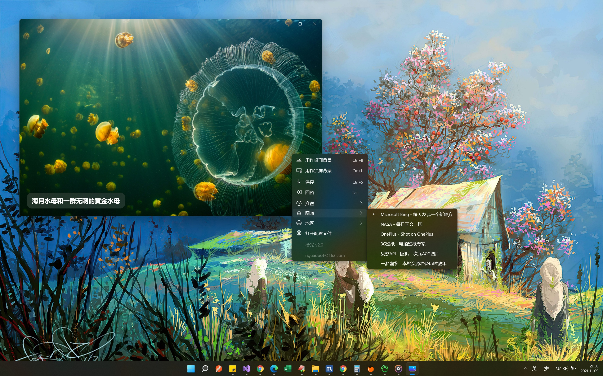

# 拾光 for Windows 11

> 拾光如歌，岁月如诗。拾光，每日一景

`拾光` 是一款壁纸应用，集成丰富图源，每日推送桌面/锁屏，使用 UWP 框架开发，是原生的 Windows 应用，支持 Windows 10/11 系统。

## 开始

如果想安装拾光，

+ 方式1：请打开右侧的 [Release](https://github.com/nguaduot/TimelineWallpaper/releases) 页面，找到最新版本，并选择适用于当前系统的安装包下载。在应用压缩包下载完成后，解压压缩包，找到 `install.ps1` 脚本，右键 **使用 PowerShell 运行**，根据提示进行安装。

+ 方式2：前往应用商店下载安装 [Microsoft Store - 拾光 for Windows 11](https://www.microsoft.com/store/apps/9N7VHQ989BB7)

**Watch** 项目，以获取应用的更新动态。

## 图源

+ [Microsoft Bing](https://cn.bing.com) - 每天发现一个新地方
+ [NASA](https://apod.nasa.gov/apod) - 每日天文一图
+ [OnePlus](https://photos.oneplus.com) - Shot on OnePlus
+ [一梦幽黎](https://www.ymyouli.com) - 本站资源准备历时数年
+ [Infinity](http://cn.infinitynewtab.com) - 365天精选壁纸
+ [3G壁纸](https://desk.3gbizhi.com) - 电脑壁纸专家
+ [Pixivel](https://pixivel.moe) - Pixel 图片缓存/代理
+ [Lofter](https://www.lofter.com) - 看见每一种兴趣
+ [呆憨API](https://api.daihan.top/html/acg.html) - 随机二次元ACG图片
+ [樱花API](https://www.dmoe.cc) - 随机二次元图片
+ [晓晴API](https://acg.toubiec.cn) - 随机二次元图片
+ [墨天逸API](https://api.mtyqx.cn) - 随机图片
+ [夏沫博客API](https://cdn.seovx.com) - 在线古风美图二次元
+ [保罗API](https://api.paugram.com/help/wallpaper) - 随机动漫壁纸

*特别注明：所有图源均为来自网络的第三方资源，本应用无权且不提供商用授权，所以请勿用于商业用途，仅供学习交流。欢迎分享图源*

# 截图

